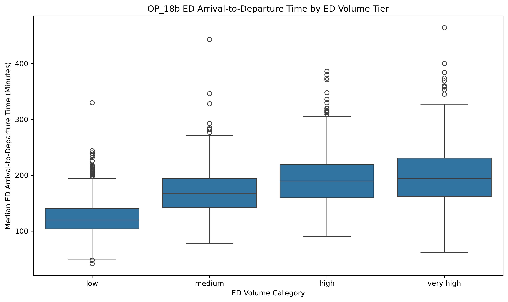
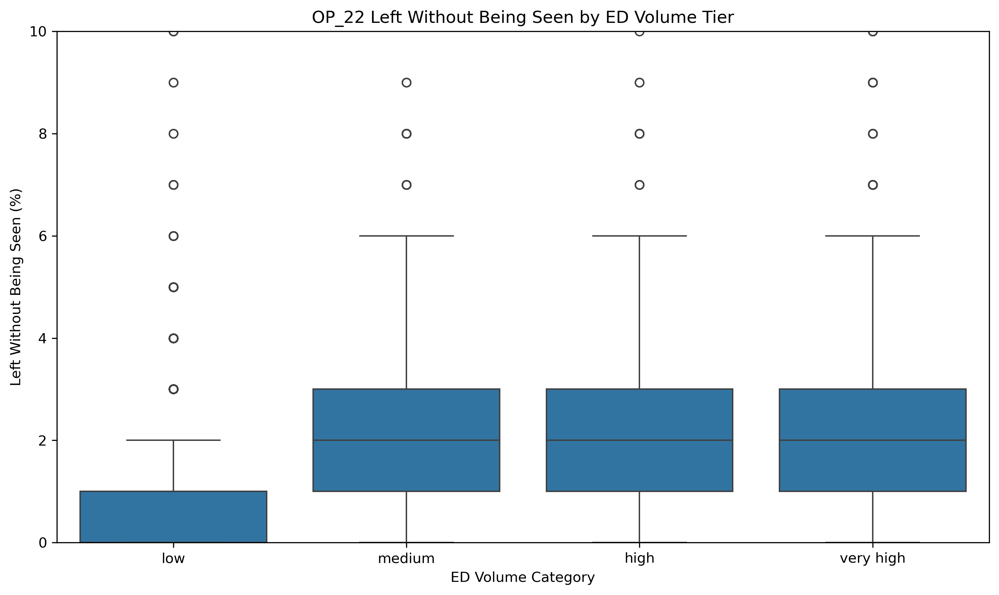
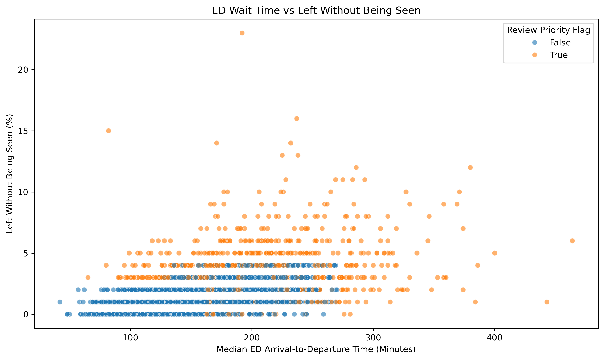
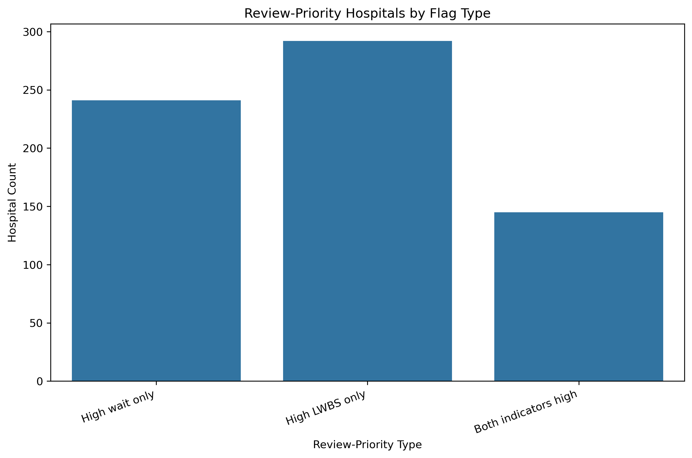

# Healthcare Operations Analytics: ED Throughput Benchmarking

## Project Overview

This project analyzes emergency-department throughput using CMS hospital public reporting data.

The goal is to identify hospitals with elevated ED throughput indicators relative to available ED-volume peer categories and prioritize them for further operational review.

This is a healthcare operations screening project, not a causal diagnosis or definitive hospital ranking.

## Business Question

Which hospitals show unusually weak emergency-department throughput indicators relative to available ED-volume peer categories and should receive further operational review?

## Stakeholders

Primary stakeholder:

- Health-system Operations / Quality Improvement Analyst

Secondary stakeholders:

- Hospital Operations Director
- Emergency Department Manager
- Quality Improvement Team

## Data Sources

Source:

- Centers for Medicare & Medicaid Services hospital public reporting data

Files used:

- `Hospital_General_Information.csv`
- `Timely_and_Effective_Care-Hospital.csv`
- `HOSPITAL_Data_Dictionary.pdf`

## Core Measures

| Measure | Description | Role |
|---|---|---|
| EDV | Emergency department volume category | Peer-group field |
| OP_18b | Median ED arrival-to-departure time for discharged patients | Numeric throughput outcome |
| OP_22 | Percentage of patients who left before being seen | Numeric access / throughput outcome |

## Tools Used

- SQL / SQLite
- Python
- pandas
- matplotlib
- seaborn
- Jupyter Notebook
- Markdown

## Methodology

The project followed a CRISP-DM-informed workflow:

1. Defined stakeholder question, scope, risks, and success criteria.
2. Acquired CMS hospital source files.
3. Loaded raw files into SQLite.
4. Validated source grain, keys, reporting windows, and missingness.
5. Created a typed staging view preserving raw scores and availability status.
6. Built a one-row-per-hospital analytical mart.
7. Loaded the validated mart into Python.
8. Profiled EDV, OP_18b, and OP_22.
9. Benchmarked hospitals within ED-volume peer categories.
10. Created review-priority flags using EDV-tier 90th percentile thresholds.
11. Produced stakeholder-facing visuals and findings.

## SQL Data Quality Checks

SQL QA confirmed:

- Hospital General Information contained 5,432 rows and 5,432 unique facilities.
- Timely and Effective Care contained 138,173 rows and 4,660 unique facilities.
- No duplicate Facility ID values were found in the hospital general table.
- No duplicate Facility ID + Measure ID combinations were found in the Timely and Effective Care table.
- EDV, OP_18b, and OP_22 each had 4,660 rows.
- All 4,660 target-measure facilities matched hospital metadata.
- Facility ID was preserved as text to retain leading zeroes.

## Analytical Population

The final analytical mart contained:

- 4,660 hospitals
- 22 columns
- one row per hospital

The EDV benchmarking population contained:

- 3,777 hospitals
- hospitals with available EDV, OP_18b, and OP_22
- 81.1% of the analytical mart

## Key Findings

### 1. Median ED wait time generally increased across ED-volume categories

| EDV Category | OP_18b Median |
|---|---:|
| low | 120 minutes |
| medium | 168 minutes |
| high | 190 minutes |
| very high | 194 minutes |

Higher ED-volume categories generally showed longer ED arrival-to-departure time distributions and wider upper tails.

### 2. OP_22 values were generally low but showed upper-tail variation

| EDV Category | OP_22 Median | OP_22 P90 |
|---|---:|---:|
| low | 1% | 3% |
| medium | 2% | 4% |
| high | 2% | 5% |
| very high | 2% | 5% |

Medium, high, and very-high EDV groups showed higher upper-tail LWBS values than low-volume EDs.

### 3. 678 hospitals were flagged as review-priority candidates

Using EDV-tier 90th percentile thresholds:

| Flag Type | Count | Percent of Benchmark Population |
|---|---:|---:|
| High OP_18b wait | 386 | 10.2% |
| High OP_22 LWBS | 437 | 11.6% |
| Any review-priority flag | 678 | 18.0% |

### 4. 145 hospitals were elevated on both ED throughput indicators

| Review-Priority Type | Count | Percent of Benchmark Population |
|---|---:|---:|
| High wait only | 241 | 6.4% |
| High LWBS only | 292 | 7.7% |
| Both indicators high | 145 | 3.8% |
| Any review priority | 678 | 18.0% |

Hospitals elevated on both indicators represent the strongest review-priority subset for further operational investigation.

## Visuals

### OP_18b ED Arrival-to-Departure Time by ED Volume Tier

### OP_22 Left Without Being Seen by ED Volume Tier

The y-axis is capped at 10% for readability.

### ED Wait Time vs Left Without Being Seen

### Review-Priority Hospitals by Flag Type

## Recommendations

1. Use EDV-tier peer benchmarking as the first screening layer for ED throughput review.
2. Prioritize hospitals elevated on both OP_18b and OP_22 for deeper operational investigation.
3. Use measure-specific review pathways for hospitals elevated on only one indicator.
4. Preserve CMS missingness and footnotes in future analysis.

## Limitations

- EDV and OP_22 use calendar year 2024.
- OP_18b uses July 2024 to June 2025.
- The measures are recent but not perfectly synchronized.
- EDV does not adjust for trauma level, staffing, capacity, patient acuity, boarding pressure, or local demand shocks.
- Review-priority flags are screening indicators, not causal diagnoses.
- Flagged hospitals should not be interpreted as poor performers or definitive rankings.
- OP_22 tied values can make percentile-based flags include more than exactly 10% of hospitals.

## Project Files

### SQL

- `sql/01_raw_staging.sql`
- `sql/02_qa_checks.sql`
- `sql/03_staging_views.sql`
- `sql/04_analytical_table.sql`

### Notebooks

- `notebooks/01_healthcare_ops_eda.ipynb
- `notebooks/02_healthcare_ops_analysis.ipynb`
- `notebooks/03_healthcare_peer_benchmarking.ipynb`

### Processed Outputs

- `data/processed/healthcare_ed_throughput_mart.csv`
- `data/processed/healthcare_ed_peer_benchmark_summary.csv`
- `data/processed/healthcare_ed_benchmark_analysis_table.csv`
- `data/processed/healthcare_ed_review_priority_table.csv`

### Documentation

- `docs/01_Phase0_Project_Initiation.md`
- `docs/02_Phase1_Data_Acquisition_Feasibility.md`
- `docs/03_Phase2_Data_Quality_SQL_Staging.md`
- `docs/04_Phase3_Analysis_Metric_Development.md`
- `docs/05_Phase4_Visualization_Dashboard.md`
- `docs/06_Phase5_Findings_Recommendations_Limitations.md`
- `docs/07_Phase6_Portfolio_Packaging.md`
- `docs/08_Decision_Log.md`
- `docs/09_Metric_Dictionary.md`
- `docs/10_SQL_Python_DAX_Spellbook.md`
- `docs/11_Progress_Tracker.md`

## How to Reproduce

1. Place CMS source files in `data/raw/`.
2. Run SQL scripts in order:
   - `01_raw_staging.sql`
   - `02_qa_checks.sql`
   - `03_staging_views.sql`
   - `04_analytical_table.sql`
3. Run the SQL staging/export notebook to export the SQL mart to `data/processed/`.
4. Run Python notebooks in order:
   - `01_healthcare_ops_eda.ipynb`
   - `02_healthcare_ops_analysis.ipynb`
   - `03_healthcare_peer_benchmarking.ipynb`