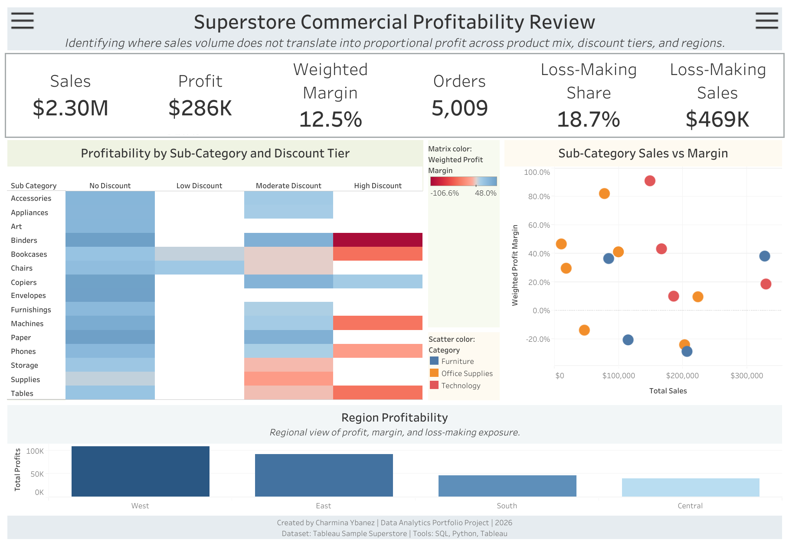

# Superstore Commercial Profitability Review

## Overview

This project analyzes the Tableau Sample Superstore dataset to identify where sales volume does not translate into proportional profit across product mix, discount tiers, and regions.

The project was designed as a two-day commercial analytics mini project using a CRISP-DM-informed workflow. The focus is on SQL staging and QA, profitability analysis, Tableau dashboarding, and business-facing interpretation.

**Primary stakeholder:** Commercial Analytics Manager or VP of Sales Operations

**Decision question:**

Which products, customer segments, regions, and discount patterns contribute to profitable growth or revenue leakage, and where should management prioritize commercial review?

---

## Dashboard

View the published Tableau Public dashboard:

[Superstore Commercial Profitability Review](https://public.tableau.com/views/SuperstoreCommercialProfitabilityReview/Dashboard?:language=en-US&:sid=&:redirect=auth&:display_count=n&:origin=viz_share_link)

Dashboard components include:

- KPI summary for sales, profit, weighted margin, orders, loss-making share, and loss-making sales
- Sub-category × discount tier profitability matrix
- Sub-category sales vs weighted margin scatter plot
- Regional profitability summary
- Collapsible Commercial Insights and Recommended Actions panels



---

## Tools Used

- **SQL / SQLite** — staging, validation, QA checks, analytical views
- **Python / pandas** — data loading, transformation, export preparation
- **Tableau Public** — dashboard development and publishing
- **Jupyter Notebook** — analysis workflow and documentation
- **Markdown** — project documentation and portfolio packaging

---

## Data Source

Dataset:

- Tableau Sample Superstore dataset

Primary analysis file:

- `Sample - Superstore.csv`

Important caveat:

This is a fictitious/sample dataset commonly used for Tableau and analytics practice. Findings should be interpreted as portfolio/demo insights rather than real company conclusions.

---

## Methodology

The project followed a phase-based analytics workflow adapted from CRISP-DM:

### Phase 0 — Project Initiation

Defined stakeholder, business problem, decision question, scope, risks, terminology guardrails, and success criteria.

### Phase 1 — Data Acquisition and Feasibility

Compared available Superstore files, selected the primary analysis file, reviewed field availability, and confirmed the dataset was feasible for commercial profitability analysis.

### Phase 2 — Data Understanding, SQL Staging and QA

Staged the raw CSV into a cleaned analytical file and SQLite database. Validated row counts, keys, grain, dates, missing values, category consistency, discount values, and profit ranges.

Confirmed grain:

> One row represents one product line item within an order.

Key QA results:

| QA Check | Result |
|---|---:|
| Rows | 9,994 |
| Distinct row IDs | 9,994 |
| Distinct orders | 5,009 |
| Distinct customers | 793 |
| Distinct products | 1,862 |
| Negative-profit rows | 1,871 |
| Sales less than or equal to zero | 0 |
| Ship date before order date | 0 |

### Phase 3 — Analysis and Metric Development

Created validated metrics and analytical summaries for:

- overall commercial performance
- category profitability
- sub-category profitability
- discount-tier profitability
- sub-category × discount-tier review
- region profitability
- customer contribution
- customer Pareto concentration
- year-over-year support context

### Phase 4 — Visualization and Dashboarding

Built and published a Tableau Public dashboard focused on identifying where sales volume does not translate into proportional profit.

### Phase 5 — Findings, Recommendations and Limitations

Separated what the data shows, what it suggests, what stakeholders could investigate, and what cannot be concluded from the available fields.

---

## Key Metrics

| Metric | Definition |
|---|---|
| Total Sales | `SUM(sales)` |
| Total Profit | `SUM(profit)` |
| Weighted Profit Margin | `SUM(profit) / SUM(sales)` |
| Line Item Count | `COUNT(*)` |
| Order Count | `COUNT(DISTINCT order_id)` |
| Customer Count | `COUNT(DISTINCT customer_id)` |
| Loss-Making Line Items | Count of rows where `profit < 0` |
| Loss-Making Line-Item Share | Loss-making line items divided by total line items |
| Loss-Making Sales | Sales attached to rows where `profit < 0` |

Important metric note:

Weighted profit margin is used instead of average row-level margin because the dataset has line-item grain and sales values vary across records.

---

## Key Findings

### 1. Profitability pressure is concentrated in specific sub-category and discount-tier combinations.

The strongest commercial review signals are concentrated in high-discount combinations:

| Sub-Category / Discount Tier | Sales | Profit | Weighted Margin |
|---|---:|---:|---:|
| Binders / High Discount | $36.1K | -$38.5K | -106.6% |
| Machines / High Discount | $73.1K | -$29.9K | -40.9% |
| Tables / High Discount | $64.8K | -$27.3K | -42.1% |
| Bookcases / High Discount | $24.3K | -$10.5K | -43.5% |
| Phones / High Discount | $34.3K | -$6.4K | -18.6% |

These combinations are priority candidates for commercial review.

### 2. Furniture has strong sales volume but weak profit conversion.

Furniture generated approximately:

- **$742.0K** in sales
- **$18.5K** in profit
- **2.5%** weighted profit margin
- **33.7%** loss-making line-item share

The weakness is concentrated mainly in:

- **Tables:** -$17.7K profit, -8.6% margin
- **Bookcases:** -$3.5K profit, -3.0% margin

Furniture should not be treated as uniformly weak; the issue is concentrated in specific sub-categories.

### 3. High-discount activity is associated with weaker observed profitability.

High-discount rows show negative aggregate profit across all three major categories:

| Category | High-Discount Profit |
|---|---:|
| Furniture | -$43.8K |
| Office Supplies | -$47.1K |
| Technology | -$34.1K |

This supports a discount and margin-control review. However, the dataset does not prove that discounts caused the losses.

### 4. Central has the weakest regional profit profile.

Central has:

- **7.9%** weighted profit margin
- **31.9%** loss-making line-item share
- **-$56.3K** loss-making profit

Region is useful as a supporting lens, but the dataset does not explain why Central has weaker profitability.

### 5. Customer contribution is meaningful but not the main project story.

The top approximately 20% of customers account for:

- **47.96%** of sales
- **59.31%** of profit

This shows historical customer contribution concentration. It is not true customer lifetime value.

---

## Recommendations

1. Review high-discount Binders, Machines, Tables, Bookcases, and Phones for pricing, promotion rules, and margin controls.

2. Investigate Furniture profitability, especially Tables and Bookcases, before making broad category-level product decisions.

3. Use Central as a regional review lens because it has the lowest weighted margin and highest loss-making exposure.

4. Validate discount reasons, product costs, promotion policy, and fulfillment or cost drivers before changing pricing strategy.

5. Monitor customer contribution by both sales and profit because high-sales customers are not always high-profit customers.

---

## Limitations

- The dataset is fictitious/sample data, so findings are portfolio/demo insights rather than real company conclusions.
- Discount patterns are observational. The data does not prove discounts caused losses.
- The dataset does not include discount reason, promotion campaign, product condition, return reason, inventory status, supplier cost, or fulfillment cost.
- Customer analysis is historical contribution only, not true customer lifetime value.
- Product-level ranking is limited because `product_id` and `product_name` are not perfectly one-to-one.
- Region reflects customer/order geography, not supply-chain routing or product shipment origin.
- Sales and profit are provided fields. Gross revenue, net revenue, and full cost structure cannot be reconstructed.

---

## Repository Structure

```text
data/
  raw/
  processed/
  database/

notebooks/
  01_superstore_eda_staging_qa.ipynb
  02_superstore_profitability_analysis.ipynb

sql/
  01_raw_staging.sql
  02_qa_checks.sql
  03_staging_views.sql
  04_analytical_table.sql

outputs/
  dashboard_data/
  screenshots/

docs/
  00_Project_Overview.md
  01_Phase0_Project_Initiation.md
  02_Phase1_Data_Acquisition_Feasibility.md
  03_Phase2_Data_Quality_SQL_Staging.md
  04_Phase3_Analysis_Metric_Development.md
  05_Phase4_Visualization_Dashboard.md
  06_Phase5_Findings_Recommendations_Limitations.md
  07_Phase6_Portfolio_Packaging.md
  08_Decision_Log.md
  09_Metric_Dictionary.md
  10_SQL_Python_DAX_Spellbook.md
  11_Progress_Tracker.md

README.md
